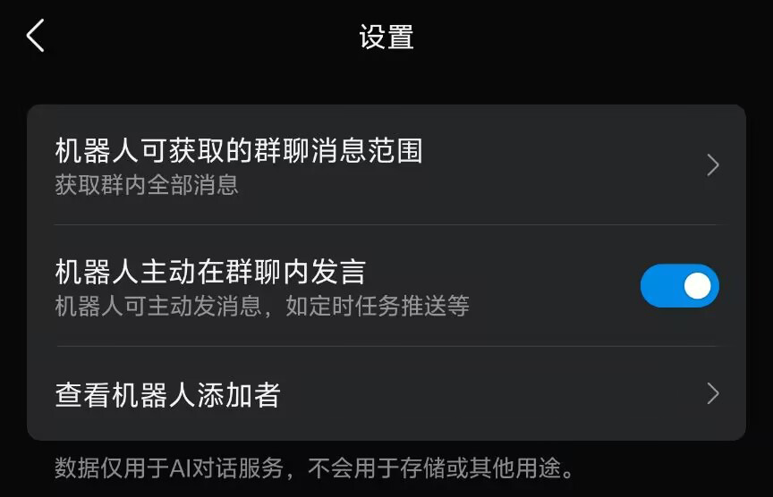

#  常见问题

## 📡 绑定失败排查指南

### 常见原因排查
1. **连接状态检查**

    ✅ 成功情况：控制台应显示"握手成功"提示

    ❌ 失败表现：无任何连接成功提示

2. **网络环境验证**

    检查服务器能否正常上网（网络连通性）

    确认防火墙未拦截相关端口

### 解决方案
▶️ **立即修复方案**：
    使用指令重建连接：`/huhobot reconnect`
    观察控制台反馈

🔄 **深度修复步骤**：

1. 检查配置文件中的 `serverId` 和 `hashKey` 是否正确
2. 确认机器人账号已登录且在线
3. 尝试重启服务端

!!! tip "专业建议"
    如多次重连失败，建议：
    
    1. 查看完整日志（debug模式更佳）

    2. 检查网络代理设置

    3. 验证服务端时间是否同步（时区问题可能导致SSL验证失败）

## 🤔 需要准备QQ号吗？
完全不需要！本方案采用全新的通信协议，彻底摆脱对第三方聊天平台的依赖。

## 🛡️ 支持哪些服务器版本？
- ✅ Spigot/Folia: 已测试版本：`1.8 - 1.21`
- ✅ EndStone: 已测试版本：`1.21.60+`
- ✅ LSE: 已测试版本：`1.21.50+`
- ✅ Allay: 已测试版本：`0.2.0+`
- ✅ Nukkit-MOT: 已测试版本：`1.21.70+`

## 🔧 如何更新配置？
- 支持热重载配置：`/huhobot reload`
- LSE版本的配置为实时更新，无需重载

## 💬 关于群服消息互通
- 更改于 `2026.6.18`
- 当前版本下 **HuHoBot** 已支持主动发送消息和全量获取信息
- 具体操作如下: 打开HuHoBot头像，右上角，改成如图

## 🌐 查在线显示其他服务器信息？
请修改配置文件中的 motdUrl字段为你的服务器地址  

示例：motdUrl: "play.yourserver.com:25565"

!!! note
    部分适配器配置文件为motd字段，请根据实际情况参考分文档查看。

## 🔍 查在线无反应怎么办？
排查步骤：  

1. 检查连接状态，使用`/huhobot reconnect`重连

2. 尝试清空 motdUrl 字段："motdUrl": ""

!!! note
    部分适配器配置文件为motd字段，请根据实际情况参考分文档查看。

## ⌨️ 执行命令无响应？
注意命令格式区别：  

- `/执行 加白`→ 用于自定义指令回调

- `/执行命令 list`→ 向控制台发送命令

## 📝 为什么执行命令无返回值？
由于部分命令不通过标准命令输出来输出到控制台，而是直接使用日志接口输出，导致无法获取命令回调。
!!! note
    Vanilla（原版）命令本身不支持从插件获取输出，故无法输出返回值

## ⏰为什么机器人老自动断连
Websocket协议可能会有假死的情况发生，为了避免这种情况，会通过重新连接刷新，通常为每`6小时`自动断连一次.

## 👥 允许玩家自助加白名单？
请按各个[适配器文档](../Adapter/index.md)配置`customCommand`字段

或 使用`自定义附属插件`来自定义

## 👮 如何设置管理员？
- 在群内使用指令：  `/管理帮助` → 查看管理指令列表
- 查看[管理员帮助页面](../AdminHelp/index.md)

## 🏰 是否支持多个服务器？
- 现已支持 !

## 👩‍👧‍👦 是否支持多个群？
- 当然支持！仅需在"/绑定"指令后加入"多群"参数即可
- `注意: 在每个群执行的时候都要加入"多群"参数，否则仍会绑定失败`
- 例如:`/绑定 test4270code414bbe5057198c4d91dc 多群`

## 🔑 客户端密钥错误怎么办？
1. **第一步**：清空 `hashKey` 值

    找到配置文件中的 `hashKey` 字段

    将其值设置为空：`hashKey: ""`

2. **第二步**：重新生成 `serverId`

    定位配置文件中的 `serverId` 字段

    删除当前字符串内容，保持为空：`serverId: ""`

    系统会自动在下次启动时生成新的ID

3. **注意事项**：

    修改后需要重载配置文件并重连机器人使更改生效

    确保配置文件格式保持YAML或JSON规范（注意缩进和冒号）

    重新生成ID会导致原有绑定关系失效，需要重新绑定
